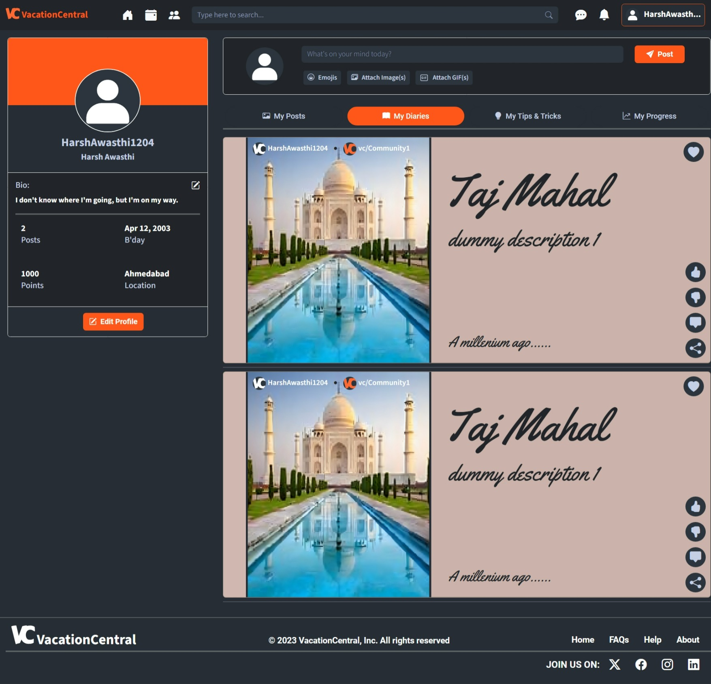

# vacation-central
A forum for socializing and planning out trips

# Vacation Central

**Vacation Central** is a web-based platform **under development**, designed to simplify socializing & trip planning through forum-like discussions, transparent itineraries, customizable public or private posts, and a friendly environment. It offers personalized trip suggestions based on user history, saving time, reducing budget concerns, and supporting the tourism industry.


## Screenshots

<!--  -->
<p float="left" align="middle">
  
  
</p>

<p float="left" align="middle">
  
  
</p>

<p float="left" align="middle">
  
  
</p>

<p float="left" align="middle">
  
  
</p>

<p float="left" align="middle">
  
  
</p>


## Run Locally

Clone the project

```bash
git clone https://github.com/HarshAwasthi1204/vacation-central.git
```

Go to the project directory

```bash
cd vacation-central
```

Create & activate a virtual environment

```bash
pip install venv

python -m venv .venv
  
.venv\Scripts\activate.bat
```

Install dependencies

```bash
pip install -r requirements.txt
```

Start the server

```bash
fastapi dev main.py
```


## Tech Stack

<div align="center">
  
  
  
  
  
  
  
  
  
  
  
  
  
</div>

###